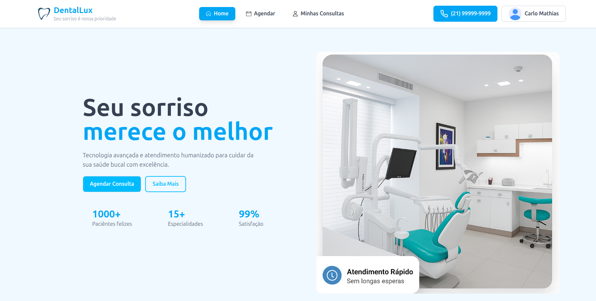
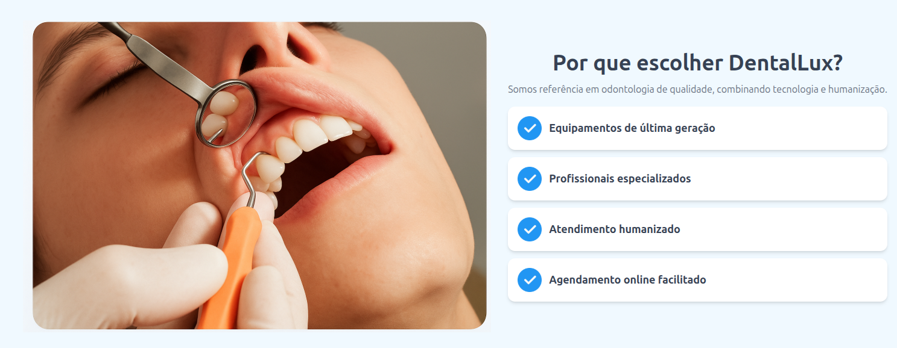
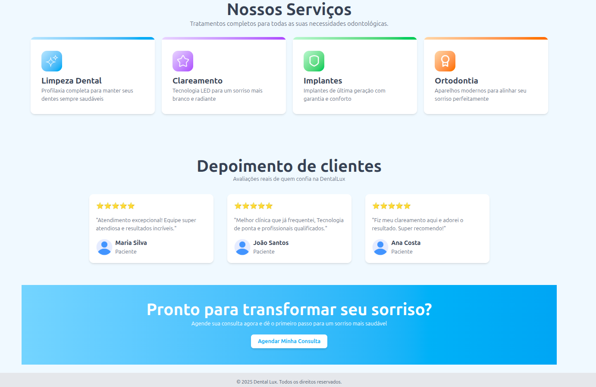

# 🦷 DentalLux

Plataforma web para **agendamento de consultas odontológicas**, desenvolvida com foco em praticidade e organização.

---

## 🚀 Tecnologias utilizadas

- **[Laravel](https://laravel.com/)** — Framework PHP principal  
- **[Laravel Sail](https://laravel.com/docs/sail)** — Ambiente de desenvolvimento com **Docker**  
- **[Tailwind CSS](https://tailwindcss.com/)** — Estilização e design responsivo  
- **[MySQL](https://www.mysql.com/)** — Banco de dados relacional  

---

## ⚙️ Como executar o projeto

```bash
# Clonar o repositório
git clone https://github.com/seu-usuario/dentallux.git

# Entrar na pasta do projeto
cd dentallux

# Subir os containers com o Sail
./vendor/bin/sail up -d

# Instalar dependências
./vendor/bin/sail composer install
./vendor/bin/sail npm install
./vendor/bin/sail npm run dev

# Rodar as migrations
./vendor/bin/sail artisan migrate
```

A aplicação estará disponível em:
👉 http://localhost:8000

# Prints das páginas




